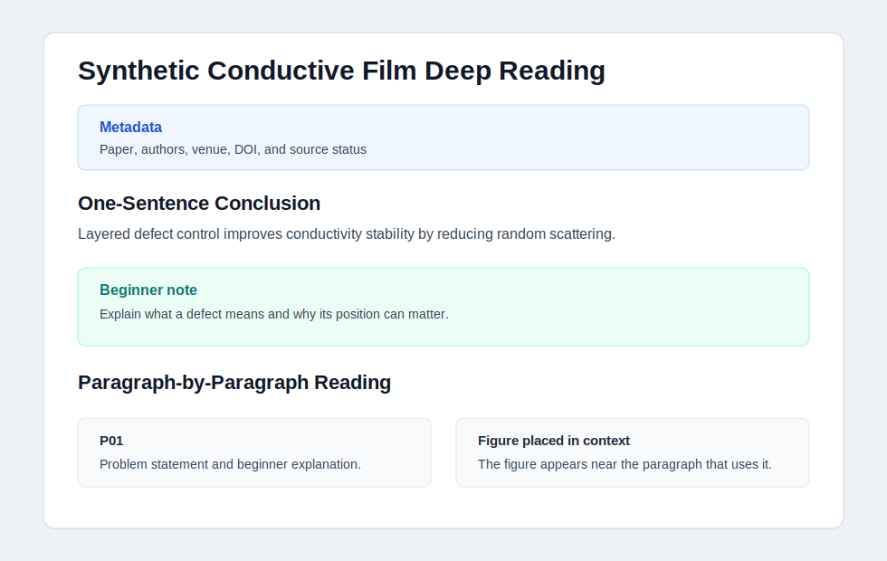
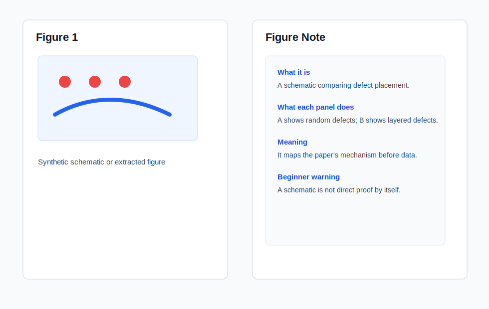

# Showcase

This page shows what the skill is expected to produce. The examples are synthetic and copyright-safe; they demonstrate structure, not claims from a real paper.

## Result Preview

## Example Outputs

- Main deep-reading note: [`examples/example-output/mini-materials-paper-deep-reading.md`](../examples/example-output/mini-materials-paper-deep-reading.md)
- Question log: [`examples/example-output/mini-materials-question-log.md`](../examples/example-output/mini-materials-question-log.md)
- Minimal structure example: [`examples/example-output/example-paper-deep-reading.md`](../examples/example-output/example-paper-deep-reading.md)

## What The Showcase Demonstrates

The expected output is not a generic summary. It should show:

- A clear one-sentence conclusion.
- A beginner primer that gives the reader missing background.
- Paragraph-level reading blocks.
- Figures placed near the relevant explanation.
- Figure notes that explain what each figure does and why it matters.
- A learning question log that merges repeated concepts.
- A final mechanism chain and discussion prompts.

## Evaluation Checklist

Use this quick checklist when reviewing generated notes:

| Check | Expected result |
|---|---|
| Paper logic | The note follows the paper's argument in order. |
| Beginner support | Difficult methods and concepts are explained at first use. |
| Figure notes | Every main figure is treated as evidence, not decoration. |
| Question log | Repeated questions are merged instead of duplicated. |
| Obsidian compatibility | Images, callouts, and links are readable in Markdown/Obsidian. |
| Copyright boundary | Public examples avoid copyrighted full-text reproduction. |
