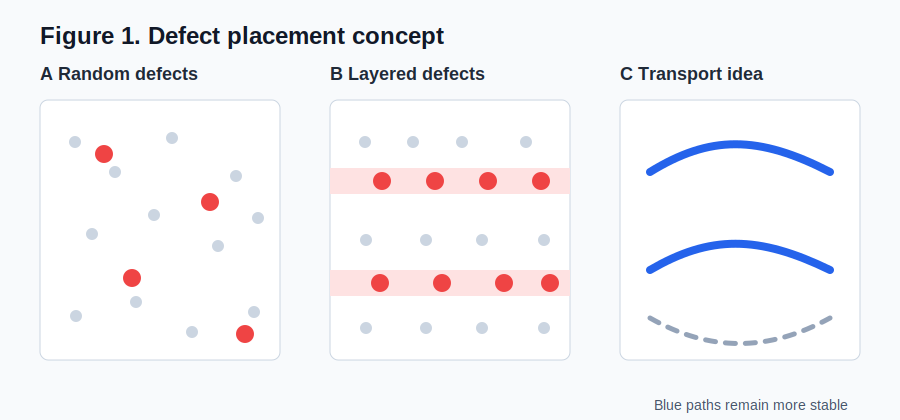
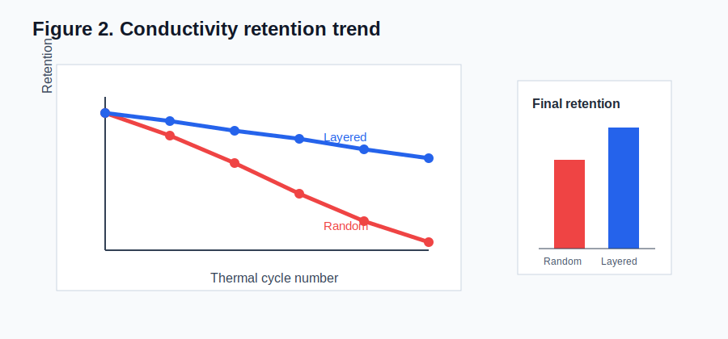

# Synthetic Conductive Film Deep Reading

> [!info] Metadata
> - Paper: Synthetic Conductive Film With Layered Defect Control
> - Authors: Example Research Group
> - Venue/year: Example Materials Journal, 2026
> - DOI: 10.0000/synthetic-film
> - Source status: Synthetic public example, not a real paper.

## One-Sentence Conclusion

The synthetic paper argues that arranging defects into weakly ordered layers improves conductivity stability by reducing random scattering while preserving enough local disorder to prevent cracking.

## Beginner Primer

A conductive film is a thin material layer that lets charge move through it. In many materials, defects are not only "bad points"; their position, density, and ordering can change how electrons move and how the film responds to stress.

> [!help] Beginner note
> Think of defects as interruptions in a road network. A few interruptions in predictable places may be easier for traffic to route around than the same number scattered randomly.

## Reading Map

1. The paper defines the problem: conductivity drops when defects are random.
2. It introduces a layered-defect design.
3. It uses microscopy and transport data to compare random and layered films.
4. It proposes a mechanism linking defect order to stable conduction.

## Abstract Translation

This example would contain a licensed translation or a non-infringing summary. The core claim is that partial defect ordering can improve property stability without requiring a perfectly ordered crystal.

## Paragraph-by-Paragraph Reading

### P01

**Meaning:** The authors begin from a practical problem: thin conductive films often lose performance after heating or bending because their internal defects are distributed randomly.

> [!help] Beginner note
> A "defect" can be a missing atom, an impurity, a shifted atomic position, or another local disruption. It is not always harmful; the effect depends on where it is and how many there are.

### P02

**Meaning:** The authors propose that defects arranged into repeated layers may reduce random electron scattering. This is the paper's central design idea.

> [!note] Figure 1 note
> **What it is:** A schematic structure figure comparing random and layered defect placement.
> **What each panel does:** Panel A shows randomly distributed defects; panel B shows defects concentrated into repeated layers; panel C turns that structure into a simple "transport path" model.
> **How to read it:** First compare where the red defect markers appear, then follow the blue arrows showing the preferred current path.
> **Meaning:** The figure explains the design principle before showing data.
> **Author's purpose:** It gives readers a mental model so the later microscopy and conductivity plots have a clear context.
> **Beginner warning:** The schematic is not direct evidence by itself. It is a hypothesis map.

### P03

**Meaning:** The microscopy evidence is used to show that the layered film really has a more periodic defect distribution than the random film.

> [!note] Figure 2 note
> **What it is:** A synthetic property plot comparing conductivity retention after repeated thermal cycles.
> **What each panel does:** Panel A tracks conductivity over cycles; panel B summarizes final retention; panel C links retention to the defect-order index.
> **How to read it:** The y-axis is retained conductivity. Higher values mean less degradation after cycling.
> **Meaning:** The plot supports the claim that layered defect control improves stability.
> **Author's purpose:** It connects the structural design in Figure 1 to a measurable property.
> **Beginner warning:** A trend line supports correlation. A mechanism still needs additional evidence or modeling.

## Glossary

| Term | Plain explanation | Role in this example |
|---|---|---|
| Defect | A local departure from ideal structure | Main design variable |
| Conductivity retention | How much conductivity remains after stress | Performance metric |
| Scattering | Interruption of charge movement | Proposed reason for performance loss |

## Mechanism Chain

> [!summary]
> Random defects increase unpredictable scattering -> layered defects reduce random interruptions -> current paths remain more stable -> conductivity retention improves after cycling.

## Group Discussion Questions

1. Is defect layering genuinely causing the stability improvement, or is it only correlated with another hidden variable?
2. What experiment would separate the effect of defect position from total defect concentration?
3. Would the same mechanism work in a thicker film, or only in the thin-film limit?
